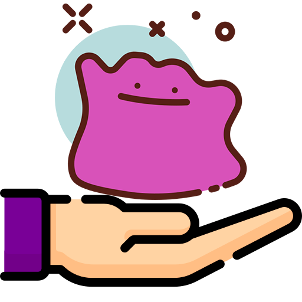
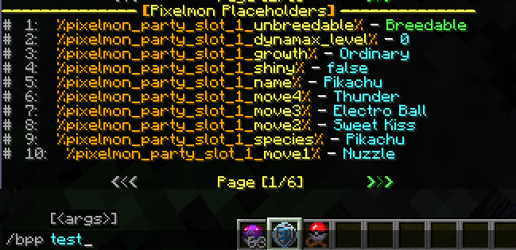

[](https://discord.petrus.dev/)
[](https://www.spigotmc.org/resources/105174/)

<p align="center">
  
</p>

# BukkitPixelmonPlaceholders

This plugin integrates the mod Pixelmon (reforged) with the plugin PlaceholderAPI, so you will be able to use Pixelmon Placeholders on most plugins!

# Requirements

This plugin requires:
- [EverNifeCore](https://github.com/evernife/EverNifeCore)
- [PlaceholderAPI](https://www.spigotmc.org/resources/placeholderapi.6245/)

# How to Build this Project

```
 [1] gradlew buildRequiredSubprojects      #This will build sub projects and move them to the libs folder
 [2] gradlew build
```

# Placeholders

Command for testing the placeholders:
> **/bpp test** _(permission: bukkitpixelmonplaceholders.command.test)_



Player Info
- Generic
    - %pixelmon_party_size_all% - Gets the number of Pokemons (couting eggs as well) In a player's party
    - %pixelmon_party_size_ableonly% - Gets the number of Pokemons (only Able Pokemons) In a player's party
    - %pixelmon_party_size_eggonly% - Gets the number of Pokemon Eggs In a player's party
    - %pixelmon_party_size_pokemononly% - Gets the number of Pokemons (ignoring eggs) In a player's party
    - %pixelmon_wins% - Gets the player's wins
    - %pixelmon_losses% - Gets the player's losses
    - %pixelmon_kdr% - Gets the player's win loss ratio
    - %pixelmon_dex_count_caught% - Gets the player's dex caught count
    - %pixelmon_dex_count_seen% - Gets the player's dex seen count
    - %pixelmon_dex_total_size% - Gets the total size of the dex
    - %pixelmon_dex_percentage% - Gets the player's dex completion percentage
    - %pixelmon_average_level% - Gets the player's party's average level
    - %pixelmon_lowest_level% - Gets the player's party's lowest level
    - %pixelmon_highest_level% - Gets the player's party's highest level
    - %pixelmon_next_legendary% - Gets the next legendary spawn time in seconds
    - %pixelmon_next_legendary_formatted% - Gets the next legendary spawn time formatted


Party Info - *Change **1** to whatever party slot you want to display Information on:*

- Generic
    - %pixelmon_party_slot_1_pokedex_number% - Gets the pokemon's National Index
    - %pixelmon_party_slot_1_exp% - Gets the pokemon's exp in the given slot
    - %pixelmon_party_slot_1_exp_to_level_up% - Gets the pokemon's exp to next level in the given slot
    - %pixelmon_party_slot_1_name% - Gets the pokemon's name in the given slot
    - %pixelmon_party_slot_1_display_name% - Gets the pokemon's display name in the given slot
    - %pixelmon_party_slot_1_species% - Gets the pokemon's species
    - %pixelmon_party_slot_1_level% - Gets the pokemon's level in the given slot
    - %pixelmon_party_slot_1_form% - Gets the pokemon's form in the given slot
    - %pixelmon_party_slot_1_form_unlocalized% - Gets the pokemon's unlocalized form in the given slot
    - %pixelmon_party_slot_1_shiny% - Gets the pokemon's shiny status in the given slot
    - %pixelmon_party_slot_1_shiny_special% - Gets the pokemon's shiny status in the given slot with a colored String.
    - %pixelmon_party_slot_1_is_egg% - Gets if the pokemon is an egg (true/false);
    - %pixelmon_party_slot_1_is_non_egg% - Gets if the pokemon is not an egg (true/false);
    - %pixelmon_party_slot_1_egg_steps% - Gets the eggs's Amount of steps remaining
    - %pixelmon_party_slot_1_egg_groups% - Gets the eggs's Group's names.
    - %pixelmon_party_slot_1_is_legendary% - Gets if the pokemon is legendary;
    - %pixelmon_party_slot_1_is_legendary_special% - Gets if the pokemon is legendary with a colored String.
    - %pixelmon_party_slot_1_originaltrainer_name% - Gets the pokemon's Original Trainer Name
    - %pixelmon_party_slot_1_originaltrainer_uuid% - Gets the pokemon's Original Trainer UUID
    - %pixelmon_party_slot_1_ability% - Gets the pokemon's ability in the given slot
    - %pixelmon_party_slot_1_gender% - Gets the pokemon's gender in the given slot
    - %pixelmon_party_slot_1_nature% - Gets the pokemon's nature in the given slot
    - %pixelmon_party_slot_1_type_all% - Gets all the pokemon's type (elements) in the given slot
    - %pixelmon_party_slot_1_type_1% - Gets the first pokemon's type (element) in the given slot
    - %pixelmon_party_slot_1_type_2% - Gets the second pokemon's type (element) in the given slot
    - %pixelmon_party_slot_1_growth% - Gets the pokemon's growth in the given slot
    - %pixelmon_party_slot_1_unbreedable% - Gets if the pokemon is unbreedable
    - %pixelmon_party_slot_1_dynamax_level% - Gets the pokemon's Dynamax Level
    - %pixelmon_party_slot_1_held_item% - Gets the pokemon's Held Item
    - %pixelmon_party_slot_1_texture% - Gets the pokemon's Texture Path
    - %pixelmon_party_slot_1_palette% - Gets the pokemon's Palette Name
    - %pixelmon_party_slot_1_palette_unlocalized% - Gets the pokemon's Palette Name Unlocalized
    - %pixelmon_party_slot_1_clones% - Gets the pokemon's Number of Mew Clones
    - %pixelmon_party_slot_1_enchantments% - Gets the pokemon's Number of Lake Trio Enchantments
    - %pixelmon_party_slot_1_hidden_power% - Gets the pokemon's Hidden Power
    - %pixelmon_party_slot_1_can_gmax% - Gets the pokemon's G-Max Potential
    - %pixelmon_party_slot_1_sprite% - Gets the pokemon's Sprite's NBT


- EVS Stats
    - %pixelmon_party_slot_1_ev_total% - Gets the pokemon's evs total value
    - %pixelmon_party_slot_1_ev_total_max% - Gets the pokemon's evs max value
    - %pixelmon_party_slot_1_ev_percentage% - Gets the pokemon's Percentage of Total IVs Gained
    - %pixelmon_party_slot_1_ev_attack% - Gets the pokemon's attack ev stat in the given slot
    - %pixelmon_party_slot_1_ev_defense% - Gets the pokemon's defence ev stat in the given slot
    - %pixelmon_party_slot_1_ev_hp% - Gets the pokemon's hp ev stat in the given slot
    - %pixelmon_party_slot_1_ev_special_attack% - Gets the pokemon's special attack ev stat in the given slot
    - %pixelmon_party_slot_1_ev_special_defense% - Gets the pokemon's special defence ev stat in the given slot
    - %pixelmon_party_slot_1_ev_speed% - Gets the pokemon's speed ev stat in the given slot
- IVS Stats
    - %pixelmon_party_slot_1_iv_total% - Gets the pokemon's ivs total value
    - %pixelmon_party_slot_1_iv_total_max% - Gets the pokemon's ivs max value
    - %pixelmon_party_slot_1_iv_percentage% - Gets the pokemon's Percentage of Total IVs Gained
    - %pixelmon_party_slot_1_iv_attack% - Gets the pokemon's attack iv stat in the given slot
    - %pixelmon_party_slot_1_iv_defense% - Gets the pokemon's defence iv stat in the given slot
    - %pixelmon_party_slot_1_iv_hp% - Gets the pokemon's hp iv stat in the given slot
    - %pixelmon_party_slot_1_iv_special_attack% - Gets the pokemon's special attack iv stat in the given slot
    - %pixelmon_party_slot_1_iv_special_defense% - Gets the pokemon's special defence iv stat in the given slot
    - %pixelmon_party_slot_1_iv_speed% - Gets the pokemon's speed iv stat in the given slot
  